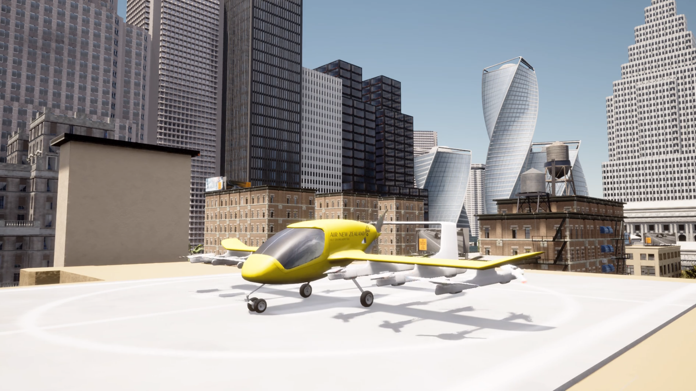

<!-- Improved compatibility of back to top link: See: https://github.com/othneildrew/Best-README-Template/pull/73 -->
<a id="readme-top"></a>
<!--
*** Thanks for checking out the Best-README-Template. If you have a suggestion
*** that would make this better, please fork the repo and create a pull request
*** or simply open an issue with the tag "enhancement".
*** Don't forget to give the project a star!
*** Thanks again! Now go create something AMAZING! :D
-->


<!-- PROJECT SHIELDS -->
<!--
*** I'm using markdown "reference style" links for readability.
*** Reference links are enclosed in brackets [ ] instead of parentheses ( ).
*** See the bottom of this document for the declaration of the reference variables
*** for contributors-url, forks-url, etc. This is an optional, concise syntax you may use.
*** https://www.markdownguide.org/basic-syntax/#reference-style-links
-->

<!--
[![Contributors][contributors-shield]][contributors-url]
[![Forks][forks-shield]][forks-url]
[![Stargazers][stars-shield]][stars-url]
[![Issues][issues-shield]][issues-url]
[![project_license][license-shield]][license-url]
[![LinkedIn][linkedin-shield]][linkedin-url]
-->


<!-- PROJECT LOGO -->
<!-- TO DO
1. Fix the "Explore the docs" link
<br />
-->
<div align="center">
  <a href="https://github.com/CPS-IL/airtaxisim">
    
  </a>

<h3 align="center">AirTaxiSim: A Simulator for Autonomous Air Taxis</h3>

  <p align="center">
    A realistic simulator of autonomous aerial vehicles in urban environments.
    <br />
    <a href="https://airtaxisim.readthedocs.org"><strong>Explore the docs »</strong></a>
    <br />
    <br />
    <a href="https://github.com/CPS-IL/airtaxisim/media/demo.mp4">View Demo</a>
    &middot;
    <a href="https://github.com/CPS-IL/airtaxisim/issues/new?labels=bug&template=bug-report---.md">Report Bug</a>
    &middot;
    <a href="https://github.com/CPS-IL/airtaxisim/issues/new?labels=enhancement&template=feature-request---.md">Request Feature</a>
  </p>
</div>


<!-- TABLE OF CONTENTS -->
<details>
  <summary>Table of Contents</summary>
  <ol>
    <li>
      <a href="#about-the-project">About the Project</a>
    </li>
    <li>
      <a href="#getting-started">Getting Started</a>
      <ul>
        <li><a href="#prerequisites">Prerequisites</a></li>
        <li><a href="#installation">Installation</a></li>
      </ul>
    </li>
    <!-- <li><a href="#usage">Usage</a></li>
    <li><a href="#roadmap">Roadmap</a></li> -->
    <li><a href="#contributing">Contributing</a></li>
    <!-- <li><a href="#license">License</a></li> -->
    <li><a href="#contact">Contact</a></li>
    <!-- <li><a href="#acknowledgments">Acknowledgments</a></li> -->
  </ol>
</details>


<!-- ABOUT THE PROJECT -->
## About the Project

<div align="center">
  
</div>


As autonomous air taxis move from science fiction to real-world transportation, one thing becomes clear: we need better tools to build and test them safely.

**AirTaxiSim** is a high-fidelity simulation framework designed to accelerate research and development in autonomous aerial mobility. Built to capture the complexities of navigating dense, dynamic urban environments, AirTaxiSim provides:

- 🔬 Realistic models of vertical take-off and landing (VTOL) vehicles  
- 🏙️ Photo-realistic urban landscapes  
- 💥 Support for edge-case testing and safety evaluation  
- 📊 Tools for generating datasets and performance benchmarks

Developing robust autonomous control for aerial vehicles is significantly more challenging than for ground robots — and we built AirTaxiSim to address exactly that. Whether you're testing navigation under bad weather conditions, evaluating perception failures, or studying coordination in multi-agent systems, AirTaxiSim helps you simulate it before you fly it.

This project is for researchers, engineers, and developers who want to push the boundaries of autonomy in the sky. 

<p align="right">(<a href="#readme-top">back to top</a>)</p>


<!-- ### Built With

* [![Next][Next.js]][Next-url]
* [![React][React.js]][React-url]
* [![Vue][Vue.js]][Vue-url]
* [![Angular][Angular.io]][Angular-url]
* [![Svelte][Svelte.dev]][Svelte-url]
* [![Laravel][Laravel.com]][Laravel-url]
* [![Bootstrap][Bootstrap.com]][Bootstrap-url]
* [![JQuery][JQuery.com]][JQuery-url]

<p align="right">(<a href="#readme-top">back to top</a>)</p> -->


<!-- GETTING STARTED -->
## Getting Started

### Prerequisites

- Ubuntu 20.04.6 LTS or 22.04.4 LTS (Other versions untested, but should work.)
- CUDA GPU for Pytorch and Unreal Engine, e.g., NVIDIA GeForce RTX series.
- Install Docker and Nvidia Docker Toolkit, see [doc/tools_installation.md](doc/tools_installation.md) for detailed instructions.
- Install Python packages with
```bash
python3 -m pip install loguru
```

### Installation

Clone this repository with submodules.

```bash
git clone https://github.com/CPS-IL/airtaxisim.git --recurse-submodules
```

### Running

Run the main script with a sample configuration:

```bash
cd airtaxisim
python3 rraaa.py configs/single-static-jaxguam.yml
```

<p align="right">(<a href="#readme-top">back to top</a>)</p>


<!-- USAGE EXAMPLES -->
<!-- ## Usage

Use this space to show useful examples of how a project can be used. Additional screenshots, code examples and demos work well in this space. You may also link to more resources.

_For more examples, please refer to the [Documentation](https://example.com)_

<p align="right">(<a href="#readme-top">back to top</a>)</p> -->


<!-- ROADMAP -->
<!-- ## Roadmap

- [ ] Feature 1
- [ ] Feature 2
- [ ] Feature 3
    - [ ] Nested Feature

See the [open issues](https://github.com/github_username/repo_name/issues) for a full list of proposed features (and known issues).

<p align="right">(<a href="#readme-top">back to top</a>)</p> -->


<!-- CONTRIBUTING -->
## Contributing

Contributions are what make the open source community such an amazing place to learn, inspire, and create. Any contributions you make are **greatly appreciated**.

If you have a suggestion that would make this better, please fork the repo and create a pull request. You can also simply open an issue with the tag "enhancement".
Don't forget to give the project a star! Thanks again!

1. Fork the Project
2. Create your Feature Branch (`git checkout -b feature/AmazingFeature`)
3. Commit your Changes (`git commit -m 'Add some AmazingFeature'`)
4. Push to the Branch (`git push origin feature/AmazingFeature`)
5. Open a Pull Request

<p align="right">(<a href="#readme-top">back to top</a>)</p>

<!-- ### Top contributors:

<a href="https://github.com/CPS-IL/airtaxisim/graphs/contributors">
  
</a> -->


## Citation

If you use AirTaxiSim in your research, please cite us:

```bibtex
@inproceedings{airtaxisim,
  title={AirTaxiSim: A Simulator for Autonomous Air Taxis},
  author={Bansal, Ayoosh and Yeghiazaryan, Mikael and Yoon, Hyung-Jin and Wang, Duo and Rasul, Ashik E and Tao, Chuyuan and Zhao, Yang and Zhu, Tianyi and So, Oswin and Fan, Chuchu and others},
  booktitle={AIAA AVIATION FORUM AND ASCEND 2025},
  pages={3349},
  year={2025}
}
```

<p align="right">(<a href="#readme-top">back to top</a>)</p>


<!-- LICENSE -->
<!-- ## License

Distributed under the project_license. See `LICENSE` for more information.

<p align="right">(<a href="#readme-top">back to top</a>)</p> -->


<!-- CONTACT -->
## Contact

Mikael Yeghiazaryan - [@mikaelyeghiazaryan](https://www.linkedin.com/in/mikaelyeghiazaryan/) - myeghiaz@illinois.edu

<!-- Project Link: [https://github.com/CPS-IL/airtaxisim](https://github.com/CPS-IL/airtaxisim) -->

<p align="right">(<a href="#readme-top">back to top</a>)</p>


<!-- ACKNOWLEDGMENTS -->
<!-- ## Acknowledgments

* []()
* []()
* []()

<p align="right">(<a href="#readme-top">back to top</a>)</p> -->


<!-- MARKDOWN LINKS & IMAGES -->
<!-- https://www.markdownguide.org/basic-syntax/#reference-style-links -->
[contributors-shield]: https://img.shields.io/github/contributors/github_username/repo_name.svg?style=for-the-badge
[contributors-url]: https://github.com/github_username/repo_name/graphs/contributors
[forks-shield]: https://img.shields.io/github/forks/github_username/repo_name.svg?style=for-the-badge
[forks-url]: https://github.com/github_username/repo_name/network/members
[stars-shield]: https://img.shields.io/github/stars/github_username/repo_name.svg?style=for-the-badge
[stars-url]: https://github.com/github_username/repo_name/stargazers
[issues-shield]: https://img.shields.io/github/issues/github_username/repo_name.svg?style=for-the-badge
[issues-url]: https://github.com/github_username/repo_name/issues
[license-shield]: https://img.shields.io/github/license/github_username/repo_name.svg?style=for-the-badge
[license-url]: https://github.com/github_username/repo_name/blob/master/LICENSE.txt
[linkedin-shield]: https://img.shields.io/badge/-LinkedIn-black.svg?style=for-the-badge&logo=linkedin&colorB=555
[linkedin-url]: https://linkedin.com/in/linkedin_username
[product-screenshot]: images/screenshot.png
[Next.js]: https://img.shields.io/badge/next.js-000000?style=for-the-badge&logo=nextdotjs&logoColor=white
[Next-url]: https://nextjs.org/
[React.js]: https://img.shields.io/badge/React-20232A?style=for-the-badge&logo=react&logoColor=61DAFB
[React-url]: https://reactjs.org/
[Vue.js]: https://img.shields.io/badge/Vue.js-35495E?style=for-the-badge&logo=vuedotjs&logoColor=4FC08D
[Vue-url]: https://vuejs.org/
[Angular.io]: https://img.shields.io/badge/Angular-DD0031?style=for-the-badge&logo=angular&logoColor=white
[Angular-url]: https://angular.io/
[Svelte.dev]: https://img.shields.io/badge/Svelte-4A4A55?style=for-the-badge&logo=svelte&logoColor=FF3E00
[Svelte-url]: https://svelte.dev/
[Laravel.com]: https://img.shields.io/badge/Laravel-FF2D20?style=for-the-badge&logo=laravel&logoColor=white
[Laravel-url]: https://laravel.com
[Bootstrap.com]: https://img.shields.io/badge/Bootstrap-563D7C?style=for-the-badge&logo=bootstrap&logoColor=white
[Bootstrap-url]: https://getbootstrap.com
[JQuery.com]: https://img.shields.io/badge/jQuery-0769AD?style=for-the-badge&logo=jquery&logoColor=white
[JQuery-url]: https://jquery.com 
